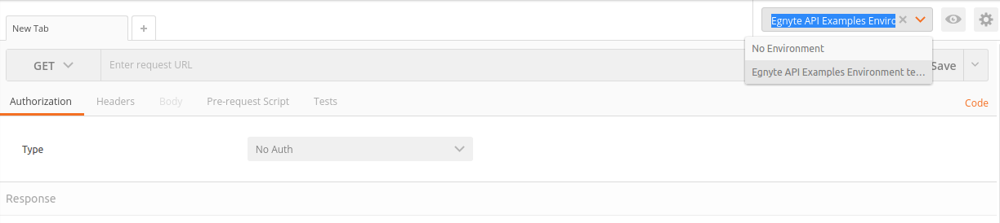
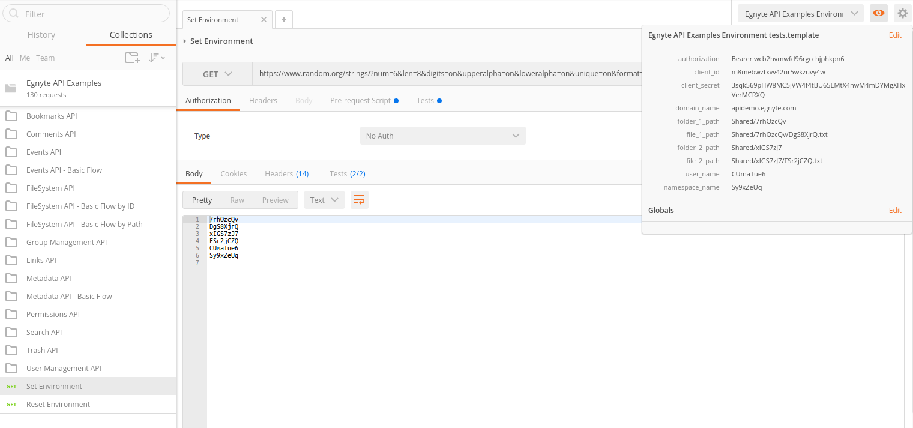
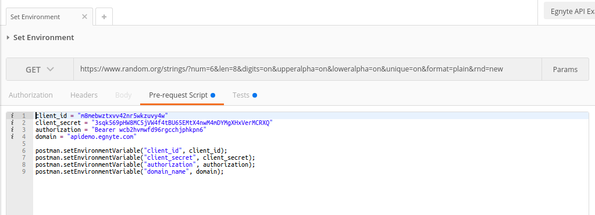
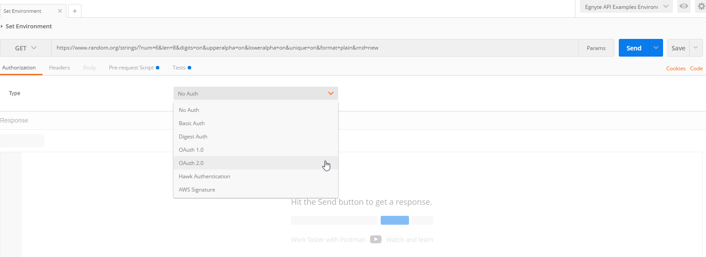

# Public API examples library

We have created a large collection of examples you can use to see all request details and real responses.

The examples are running in **Postman** and you will need to have [Postman installed](https://www.getpostman.com).

If you are not familiar with Postman:
* [Check docs](https://www.getpostman.com/docs)
* Read about [variables in Postman](https://www.getpostman.com/docs/postman/environments_and_globals/variables) beacause we use them a lot in here

Or if you prefer video:

* [Introduction to Postman](https://www.youtube.com/watch?v=ptvV_Fc3hd8&list=PLM-7VG-sgbtCJYpjQfmLCcJZ6Yd74oytQ)
* [Using Environments](https://www.youtube.com/watch?v=wArvaHYdw2I&list=PLM-7VG-sgbtCJYpjQfmLCcJZ6Yd74oytQ)

----
## Getting Started
1. Get collection and environment
	* With a click of a button: [](https://app.getpostman.com/run-collection/b860a9fb1916db9a7054#?env%5BEgnyte%20API%20Examples%20Environment%5D=W3siZW5hYmxlZCI6dHJ1ZSwia2V5IjoiYXV0aG9yaXphdGlvbiIsInZhbHVlIjoiQmVhcmVyIHdjYjJodm13ZmQ5NnJnY2NoanBoa3BuNiIsInR5cGUiOiJ0ZXh0In0seyJlbmFibGVkIjp0cnVlLCJrZXkiOiJjbGllbnRfaWQiLCJ2YWx1ZSI6Im04bWVid3p0eHZ2NDJucjV3a3p1dnk0dyIsInR5cGUiOiJ0ZXh0In0seyJlbmFibGVkIjp0cnVlLCJrZXkiOiJjbGllbnRfc2VjcmV0IiwidmFsdWUiOiIzc3FrNTY5cEhXOE1DNWpWVzRmNHRCVTY1RU10WDRud000bURZTWdYSHhWZXJNQ1JYUSIsInR5cGUiOiJ0ZXh0In0seyJlbmFibGVkIjp0cnVlLCJrZXkiOiJkb21haW5fbmFtZSIsInZhbHVlIjoiYXBpZGVtby5lZ255dGUuY29tIiwidHlwZSI6InRleHQifV0=)
	* or [Download collection](https://egnyte.egnyte.com/dl/JR2P8Ly1jj) and [Download environment](https://egnyte.egnyte.com/dl/PWTOhbLIVz) and import them.
1. Set active environment
	* It should be **imported with 'Run in Postman' button** 
	* Download from **link above**
	* **Add new** ([tutorial here](https://www.getpostman.com/docs/postman/environments_and_globals/manage_environments))
1. To set default credentials run `Set Environment` at the bottom of the collection - it uses random strings for random folder paths 
1. Go to some `Basic Flow` sections like `Filesystem API - Basic Flow` and try it **step by step** (use 'Reset Environment' for new random values)
1. Read about **API details** on [developers.egnyte.com](https://developers.egnyte.com/docs/read/Home)

----
## Custom credentials
2. Go to `Set Environment`
2. Choose `Pre-request Script` tab
2. Change your credentials (to obtain authorization variable value read next section) 
2. Send request!

----
## Authentication

3. Set your credentials in `Set Environment` request in `Pre-request Script` tab and send it *(you don't need authorization value right now, leave it as it is)*
3. Click `Authorization` tab
3. Choose `OAuth 2.0` from the list 
3. Click `Get New Access Token` button
3. **Copy** the following **without changing text** to form in Postman

Name | Value
--- | ---
Token Name | {Choose name for your token}
Auth URL | https://{{domain_name}}/puboauth/token?client_id={{client_id}}&amp;redirect_uri=https://www.getpostman.com/oauth2/callback&amp;response_type=code
Access Token URL | https://{{domain_name}}/puboauth/token
Client ID | {{client_id}}
Client Secret | {{client_secret}}
Scope | Egnyte.filesystem Egnyte.user Egnyte.group Egnyte.link Egnyte.permission Egnyte.bookmark Egnyte.launchwebsession
Grant Type | Authorization code
Client Authentication | Send client credentials in body

**Now you can use the obtained token - check "Custom credentials" section above.**

*More details: [developers.egnyte.com](https://developers.egnyte.com/docs/read/Home)*
