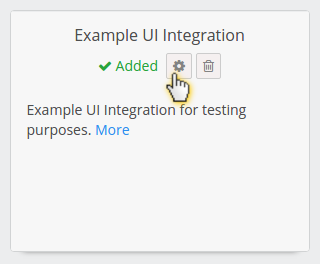

# App Settings

Your integration will be featured in our *Apps & Integrations*, also known as *Apps & Integrations*, where it can provide an option to open a user settings screen.

All you need to do to have that option is to provide `userSettings` field in your App Definition ([what's an App Definition?](./ui-framework.md))

The field must include a `https://` url to your app's settings screen.

`globalSettings` is also supported. It works the same as userSettings, but opens only for admins and your settings are separated per Egnyte domain not each user.

## UI Integration

**If you're building a [UI integration](./ui-framework.md)** you can leverage Egnyte to store your settings per user and get them back with every invocation.

Settings stored in our database are encrypted, in case you wondered if you can keep access tokens to your app there.

Detailed settings documentation along with invocation flow docs is available here: [UI Integration Framework user settings](https://github.com/egnyte/for-integrators/blob/master/doc/UIntegrate_flow.md#ui-integration-framework-user-settings-flow)
