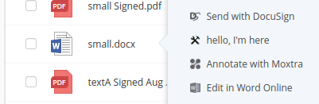

# Editor

## Introduction

This is an extension of [Context menu option](context-menu.md) but you don't have to read it first, all relevant content is duplicated here.

Your editor will become available in context menu for file extensions that you handle.


Some time in 2017 it will also become available in a separate menu accessible from the preview screen.

### Use this recipe if you:
- Want to provide editing capabilities for certain file types

## Ingredients

- Two tablespoons of understanding: [Egnyte-specific terms](definitions.md)
- [UI Integration Framework](./ui-framework.md)
- Development environment with access to App Definition form (ask your partner account manager)
- App Definition for your app
- [Public API for file system](https://developers.egnyte.com/docs/read/File_System_Management_API_Documentation)
  - get file metadata
  - get file contents
  - upload file
  - lock (optional)

## Steps

As you see, there's no Auth mentioned in ingredients. That's because Egnyte is going to send API access tokens in invocations.

It's important for UI Integrations to keep this token a secret (not expose it to the browser by passing it in URLs, cookies or localStorage).

1. Go to your development sandbox domain, open *Apps & Add-Ons*, click to "Manage my app definition" and switch type to Egnyte UI Integration
1. Fill it in according to App Definition docs. Focus on configuring endpoint URLs you want to implement. You need to provide the `integrations` field as JSON. See below for details on configuring your editor.
1. Go back to *Apps & Add-Ons*, find your app on the listing and **enable**, then switch from admin mode to user mode and **add** it for your current user.
1. Read about UI Invocation and implement first two steps - the POST endpoint and the `browserFacingUrl` handler
1. Run it form context menu of your sandbox domain for testing.
1. If you don't have reasons to do otherwise, follow the [Suggested steps to ensure invocation is securely handled](https://github.com/egnyte/for-integrators/blob/master/doc/UIntegrate_flow.md#suggested-steps-to-ensure-invocation-is-securely-handled) to pin the invocation input to user session as step 3. **Important: make sure the url you send back to Egnyte can't be used by someone else**. If you don't want to use the suggested steps or you're having trouble following the diagram, [get in touch](./contact.md)
1. Build your functionality using the token passed in invocation to fetch files and save changes back once editing is done (or periodically).
1. Also note that you can use locks to make sure noone else is editing the same file simultaneously.
1. Bake your integration and send it for certification.


### Editor definition

Example definition for an image editor service "ExamplePaint".

```
    "integrations": {
        "editExamplePaint": {
            "entryPoint": "context_menu",
            "types": [
                "file"
            ],
            "serviceUrl": "https://example.com/ExamplePaint/files/invoke",
            "extensions": [
                "bmp",
                "png",
                "jpeg",
                "jpg"
            ],
            "permissionLevels": [
                "owner",
                "full",
                "editor"
            ],
            "invocationMethod": "post_to_tab",
            "icon": "https://example.comExamplePaint/static/edit_icon.png",
            "text": "Edit in ExamplePaint"
        }
    },
```

It includes a specification of extensions and makes sure it's only available if the user can write back to the file.

It doesn't specify quantity of files, so it's only available if a single file is selected.


### Creating a new file

Some time in 2017 we will also make a new "new_menu" entrypoint available. It will let you add an option for creating new files of your preferred type.
For now you can implement that functionality in "more_menu" entrypoint, as the protocol is going to be identical. All you'll need to change once new menu is available is the entrypoint name in your definition.
