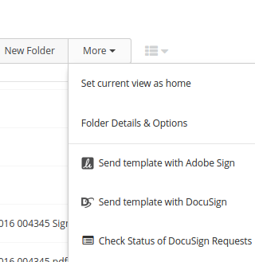
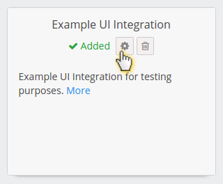

# Elaborate options in Egnyte Connect UI

## Introduction

This is an extension of [Context menu option](context-menu.md) but you don't have to read it first, all relevant content is duplicated here.

Your product can be instantly accessible to Egnyte customers through a UI intergation, but there's more to it than just the context menu.

### Use this recipe if you:
- want have your functionality available in Egnyte UI context menus.
- want to handle various interactions with your product through Egnyte UIs
- want to show screens and interact with the user who chose to use your option

## Ingredients

- Two tablespoons of understanding: [Egnyte-specific terms](definitions.md)
- [UI Integration Framework](./ui-framework.md)
  - context_menu
  - more_menu
  - new_menu
  - preview (coming soon)
  - user settings
- Development environment with access to App Definition form (ask your partner account manager)
- App Definition for your app
- [Public API for file system](https://developers.egnyte.com/docs/read/File_System_Management_API_Documentation)

## Steps

As you see, there's no Auth mentioned in ingredients. That's because Egnyte is going to send API access tokens in invocations.

It's important for UI Integrations to keep this token a secret (not expose it to the browser by passing it in URLs, cookies or localStorage).

1. Go to your development sandbox domain, open *Apps & Integrations*, click to "Manage my app definition" and switch type to Egnyte UI Integration
1. Fill it in according to App Definition docs. Focus on configuring endpoint URLs you want to implement. You need to provide the `integrations` field as JSON.
1. Use multiple entrypoints for different kinds of features. See below for details
1. Go back to *Apps & Integrations*, find your app on the listing and **enable**, then switch from admin mode to user mode and **add** it for your current user.
1. Read about UI Invocation and implement first two steps - the POST endpoint and the `browserFacingUrl` handler
1. Run it form context menu of your sandbox domain for testing.
1. If you don't have reasons to do otherwise, follow the [Suggested steps to ensure invocation is securely handled](https://github.com/egnyte/for-integrators/blob/master/doc/UIntegrate_flow.md#suggested-steps-to-ensure-invocation-is-securely-handled) to pin the invocation input to user session as step 3. **Important: make sure the url you send back to Egnyte can't be used by someone else**. If you don't want to use the suggested steps or you're having trouble following the diagram, [get in touch](./contact.md)
1. Add `userSettings` screen if needed. See [User Settings](app-settings.md)
1. Build your functionality using the token passed in invocation to fetch files and save changes.
1. Bake your integration and send it for certification.

### Recommended use of entrypoints

You can configure multiple functionalities on the same entrypoint. They can vary based on user privileges, file types, folder locations and more.

Sometimes it's worth to configure multiple entries to the same functionality just for the chance to specify a different caption, eg. depending on user privileges "Edit in X" or "Preview in X"

*A good example of multiple entrypoints in use is the DocuSign integration, which uses context menu for sending file for signature, more menu for listing pending signatures and new menu (once available, currently more menu) to start a signing process with a pre-defined template that will then be saved to current folder.*

#### context_menu
Use it to add your functionalities in a way that allows handling files and folders, also when multiple are selected. All operations on existing files will go to context_menu

#### more_menu
Use it to add functionality to current folder or expose features that do not belong elsewhere (like summaries of jobs currently being handled by your integration that context menu option starts)

#### new_menu (available soon)
Works the same as more_menu - invokes your integration with a reference to current folder. It's much easier for the user to discover. Before it's available, you can use "more_menu" and switch later with no changes to your codebase.

Implementing "New" option you can:
- ask the user for a filename and check if a file with the same name already exist
- generate multiple files or folders (think project structure from template) based on user input
- pre-populate the file of a certain type with correct content for an empty file, eg. docx format.
